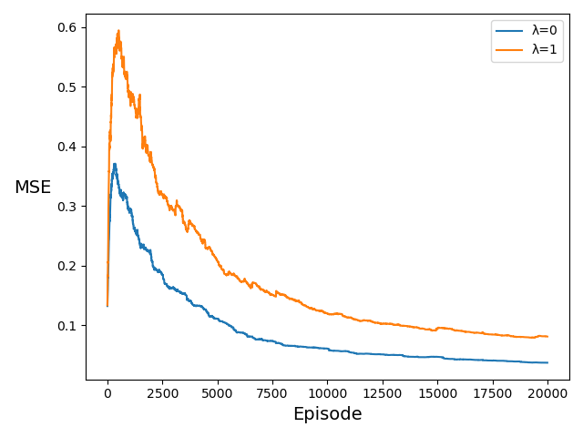
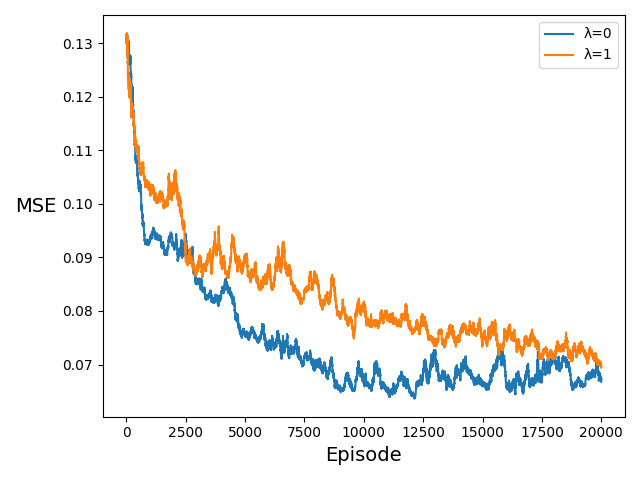

# easy21
My solution to David Silver's Easy21 sssignment. I wrote this completely from scratch without looking at anything other than the book. Comments and suggestions are more than welcome!

***main.py*** should take care of everything in the assignment.

## Monte Carlo

### Progression of Q by Episode Number

* ####1E4
.png)

* ####1E5
.png)

* ####1E6
.png)

## Sarsa(λ) - Tabular

## Learning Curves

## MSE by λ

* ###1E3
.png)

* ###2E4
.png)

## Sarsa(λ) - Approximate

## Learning Curves

## MSE by λ

* ###1E3
.png)

* ###2E4
.png)